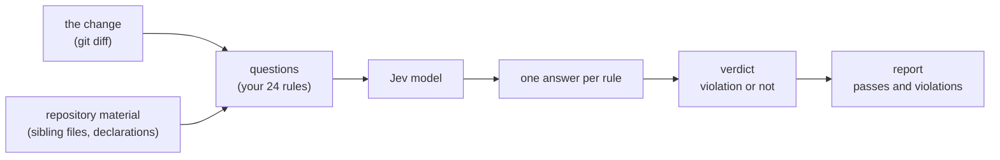
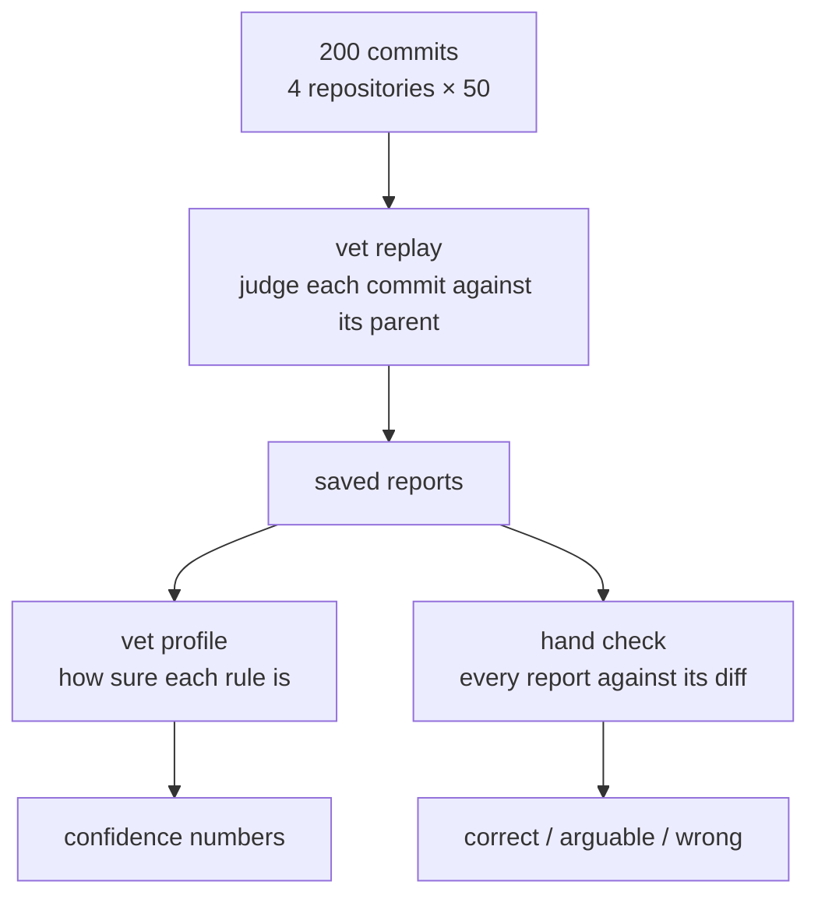

# Measuring vet

`vet` judges a git change against a file of written rules and reports which
rules it violates. This document records how we measured whether those reports
can be trusted, so a team can decide whether `vet` is ready for production.

The short answer: we judged 200 real commits across four repositories, and
`vet` made 24 reports. One was wrong, three were arguable, the rest were
correct. Most rules answer decisively rather than guessing, and a typical
commit is judged in about one second.

## The rules

`vet` measures a change against question files that encode a team's review
policy. The files used for this measurement live in a public gist:

- [comments.yaml, naming.yaml, testing.yaml](https://gist.github.com/hpcsc/1b15d7fc04d0e6753a88a9ef19cfacfc)

Together they hold 24 rules across three areas: how code is commented, how
it is named, and how it is tested.

## How vet judges a change

A rule answers one of three ways. A `noul` rule gives a probability that the
change violates it; a `choice` rule picks one option from a fixed set; a
`score` rule rates the change on a small scale. `vet` turns each answer into a
pass or a violation and prints the result.

## What we measured

Three properties decide whether the reports can be trusted:

| Property | Question | Metric |
| --- | --- | --- |
| Correctness | Is each report actually a violation? | Precision — hand-check every report against its diff |
| Confidence | Does the model answer, or guess? | Near-limit — how many answers sit close to the violation threshold |
| Speed | Is it fast enough to run on every change? | Wall-clock per commit |

## How we measured

The sample is 200 real commits — 50 each from four Go repositories: `vet`
itself, `strata`, `mutants`, and `emod`, all four the author's own. Each commit
is judged against its parent commit, so the model sees the same thing it would
see in a real review.

The measurement uses the commands `vet` ships, so anyone can reproduce it:
`vet replay` judges a list of commits and saves the reports, and `vet profile`
reads them back and reports how near each rule sits to its threshold. The last
step — reading every report against the diff it came from — is done by hand,
because "is this a real violation" is a judgement a person makes, not a number.

## The result

### Correctness

Across 200 commits, `vet` made 24 reports. Every one was read against its
diff:

| Outcome | Count | Share | What it was |
| --- | --- | --- | --- |
| Correct | 20 | 83% | e.g. a package doc comment, a test file named for its role with no file to test, a test that reads the production source and asserts on its text |
| Arguable | 3 | 12% | a `generic` name that is defensible, a long comment that carries a real reason |
| Wrong | 1 | 4% | a file rename |

One report in twenty-four was wrong, and it was a mechanical edge case — a
commit that renamed a file and its test together. None of the wrong or arguable
reports would hide a bug; they are the kind of thing a reviewer reads, agrees
or disagrees with, and moves on.

The twenty-four reports came from eight rules:

| Rule | Reports | How they were judged |
| --- | --- | --- |
| `test-file-name` | 9 | 8 correct, 1 wrong (the rename) |
| `package-doc-comment` | 3 | 3 correct |
| `comment-quality` | 3 | 3 correct |
| `comment-carried-by-code` | 2 | 1 correct, 1 arguable |
| `struct-naming` | 2 | 2 arguable (`generic` names) |
| `tests-through-public-api` | 2 | 2 correct |
| `testing-quality` | 2 | 2 correct |
| `interface-compliance-check` | 1 | 1 correct |

The drop in noise is the point. A first measurement of a 9-commit sample made
9 reports and only 5 of them were right. After removing the rules a model
cannot decide, this measurement made 24 reports across 200 commits — findings,
not noise.

### Confidence

A rule is reliable only when the model answers, not guesses. `vet profile`
counts, per rule, how many answers land close to the violation threshold:

| Rule | Answers near the threshold |
| --- | --- |
| `assertion-strictness-mismatch` | 13% – 35% |
| `comment-carried-by-code` | 9% – 22% |
| every other rule | 0% – 9% |

Only two rules sit near the threshold at all, and both are genuine judgement
calls — how strictly an assertion should be written, and whether a comment
repeats what the code already says. Every other rule answers with the
confidence of a real decision.

### Speed

| | Time |
| --- | --- |
| Typical commit | about 1 second |
| Slowest commits | up to about 13 seconds, on very large files or diffs |

Most commits are judged in about a second. The slow tail is commits that add a
very large file or rewrite one, because the whole change goes into the prompt.
That is a known trade-off between speed and how much context a rule gets.

## What this means for production

`vet` is ready to run on real changes because:

- **Low noise.** 24 reports over 200 commits is a review aid, not a fire hose.
- **High precision.** Twenty of twenty-four reports were right, three were
  arguable, one was wrong — and the one wrong one was a rename, not a defect.
- **Decisive.** The model answers most rules with confidence instead of
  splitting the difference at the threshold.
- **Measurable.** `vet replay` and `vet profile` let a team keep the numbers
  honest as their rules change, and `vet` caches answers so a re-run of the
  same change reports the same result.
- **Fast.** A typical change is judged in about a second.

The rules themselves are the contract. A rule the model cannot decide was
removed rather than kept, which is why the reports that remain are the ones a
team can act on.

## Known limits

- The sample is the author's own code, which already leans toward the author's
  conventions. Code that does not follow them would report more.
- A file that is renamed together with its test can confuse `test-file-name`.
- `struct-naming` and `assertion-strictness-mismatch` are the two rules where
  the model is least sure, because both are matters of taste as much as fact.
- Large files and large diffs make a single judgement slower, because their
  whole text is read into the prompt.

None of these limits produce a wrong answer about whether code works. They
produce, at worst, a report a reviewer reads and decides on their own — which
is exactly the job `vet` is meant to hand back to a person when the answer is
not certain.
