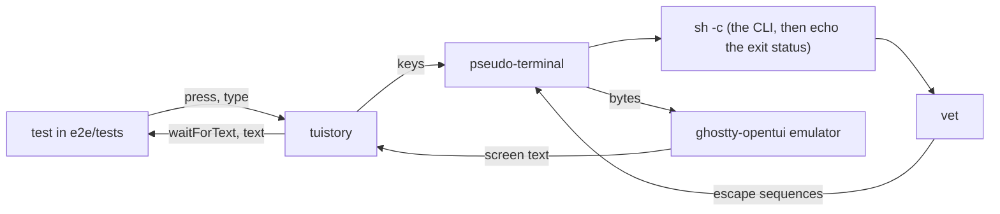
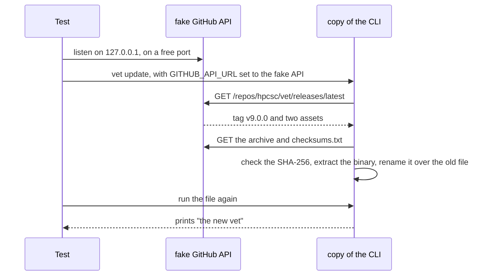
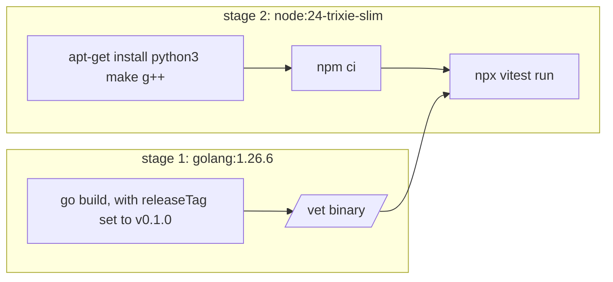

# How the end-to-end tests work

The end-to-end tests run the vet binary in a terminal, send keys to it, and read the
screen. They find faults that the Go tests cannot find: the real terminal output, files on disk, and
exit codes.

The tests are in `e2e/`. `e2e/testUtils.ts` has the helpers, and `e2e/tests/` has the tests.

## Parts

| Part | Job |
| --- | --- |
| vitest | Finds and runs the tests in `e2e/tests/`. |
| tuistory | Starts a program in a pseudo-terminal, sends keys to it, and gives its screen as text. |
| node-pty | Makes the pseudo-terminal for tuistory. |
| ghostty-opentui | The terminal emulator in tuistory. It turns the output of the CLI into a screen of text. |
| `testUtils.ts` | Makes throwaway folders, starts the CLI, and deletes the folders after each test. |

## Plain commands and screen tests

Two helpers start the CLI:

| Helper | Use for | How it works |
| --- | --- | --- |
| `runCli(cwd, args, env)` | Commands that print and stop, such as `version` and `update` | Starts the CLI as a child process with pipes. It gives stdout, stderr and the exit status. |
| `openCli(cwd, args, env)` | The screen, and commands that ask for input | Starts `sh -c 'printf "\033[20l"; <env> <cli> <args>; echo "EXIT:$?"'` in a pseudo-terminal. When the CLI stops, the shell writes its exit status on the screen, so a test can wait for `EXIT:0`. [New line mode](#new-line-mode) tells why the command starts with `printf`. |

`runCli` does not block. The update tests run a fake server in the test process, and that server must
answer while the CLI waits for it.

## New line mode

The emulator in tuistory starts in new line mode. In that mode, a line feed moves the cursor to the next
line and also back to column 1. A real terminal starts with the mode off, so a line feed keeps the column.

A full screen program, such as a Bubble Tea one, draws only the cells that change. It moves the cursor
down with a line feed and expects the column to stay the same. In new line mode, the text then goes to the
wrong column.

So `openCli` writes `\e[20l`, which turns new line mode off, before it starts the CLI.

## The update tests

The update tests start a fake GitHub API in the test process and point the CLI at it with
`GITHUB_API_URL`. The fake release holds an archive for the platform of the test and a `checksums.txt`.
The "new binary" in the archive is a shell script, so the test can see that the update replaced the file.

Each update test runs a copy of the CLI in its own folder. The update replaces that copy, so the other
tests keep the original binary.

## Where the tests run

| Command | Where | What it needs |
| --- | --- | --- |
| `task test:e2e` | Docker | Docker. CI runs this command. |
| `task test:e2e:local` | This machine | Node |

Both commands build the CLI with the tag in `E2E_TAG` in `Taskfile.test.yml`, which is `v0.1.0`. They set
two environment variables for the tests: `EXECUTABLE`, the path of the binary, and `BUILD_TAG`, the tag.
The `version` and `update` tests compare the output of the CLI with `BUILD_TAG`.

The Docker image has two stages:

`python3`, `make` and `g++` let npm build node-pty when no prebuilt node-pty fits the platform. The image
runs `npm ci` when `e2e/package-lock.json` is in the repository, and `npm install` when it is not. Commit
the lock file, so every run installs the same packages.

In GitHub Actions, the `e2e` job in `.github/workflows/ci.yml` runs `task test:e2e` on `ubuntu-latest`,
which has Docker. The release workflow calls the CI workflow, so a release waits for these tests too.

## How to write a new test

1. Make a folder with `scratchDir()`.
2. Start the CLI with `openCli(dir)`, or with `runCli(dir, args)` when the command prints and stops.
3. Wait for text that shows that the screen is ready, for example `Name:`.
4. Send keys with `press`. Use `type` for text and for capital letters, because the key names in tuistory
   have lower case letters only.
5. Wait for the text that proves the result. Then check the rest of the screen with `expect`.

Keep these rules:

- **Wait for the text that you check, not for a title:** a program that loads in the background can show a
  title before its content.
- **Give each test its own folder:** `scratchDir()` makes the folder, and `onTestFinished` deletes it.
- **Do not change the terminal size:** `openCli` uses 160 columns and 40 rows, and the tests expect text
  that fits that size.
