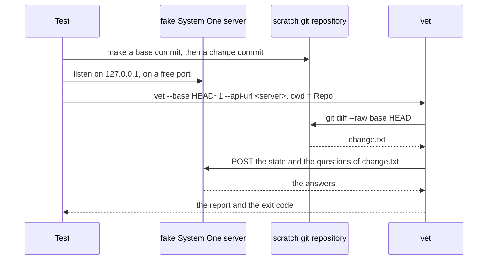
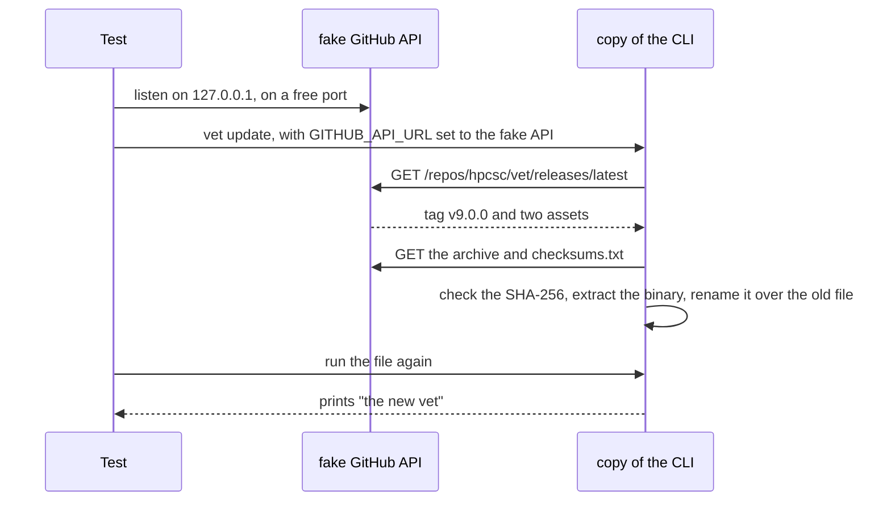
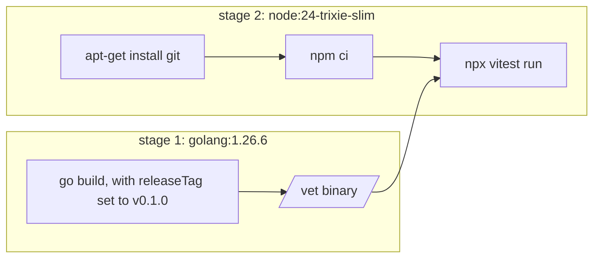

# How the end-to-end tests work

The end-to-end tests run the vet binary against a fake server and throwaway git
repositories. They find faults that the Go unit tests cannot find: the real binary,
real git plumbing, and the exit codes.

The tests are in `e2e/`. `e2e/testUtils.ts` has the helpers, and `e2e/tests/` has the tests.

## Parts

| Part | Job |
| --- | --- |
| vitest | Finds and runs the tests in `e2e/tests/`. |
| `testUtils.ts` | Makes throwaway folders and git repositories, starts the CLI, and deletes the folders after each test. |

The judge tests build a scratch git repository with a base commit and a later
commit, so the CLI has a real diff to judge.

## How the tests run the CLI

`runCli(cwd, args, env)` starts the CLI as a child process with pipes. It gives
stdout, stderr and the exit status. The tests cover commands that print and stop,
such as `version`, `update` and `judge`, so no pseudo-terminal is needed.

`runCli` does not block. The judge and update tests run a fake server in the test
process, and that server must answer while the CLI waits for it.

## The judge tests

The judge tests start a fake System One server in the test process and point the
CLI at it with `--api-url`. The server answers every question the CLI asks. The
tests cover the full flow: a change that passes, a change that violates, the JSON
output, and the exit codes 0, 1 and 2.

## The update tests

The update tests start a fake GitHub API in the test process and point the CLI at it
with `GITHUB_API_URL`. The fake release holds an archive for the platform of the test
and a `checksums.txt`. The "new binary" in the archive is a shell script, so the test
can see that the update replaced the file.

Each update test runs a copy of the CLI in its own folder. The update replaces that
copy, so the other tests keep the original binary.

## Where the tests run

| Command | Where | What it needs |
| --- | --- | --- |
| `task test:e2e` | Docker | Docker. CI runs this command. |
| `task test:e2e:local` | This machine | Node |

Both commands build the CLI with the tag in `E2E_TAG` in `Taskfile.test.yml`, which is
`v0.1.0`. They set two environment variables for the tests: `EXECUTABLE`, the path of
the binary, and `BUILD_TAG`, the tag. The `version` and `update` tests compare the
output of the CLI with `BUILD_TAG`.

The Docker image has two stages:

`git` makes the scratch repositories that the judge tests run the CLI against. The
image runs `npm ci` when `e2e/package-lock.json` is in the repository, and `npm
install` when it is not. Commit the lock file, so every run installs the same packages.

In GitHub Actions, the `e2e` job in `.github/workflows/ci.yml` runs `task test:e2e` on
`ubuntu-latest`, which has Docker. The release workflow calls the CI workflow, so a
release waits for these tests too.

## How to write a new test

1. Make a folder with `scratchDir()`. For a judge test, make a git repository with
   `gitRepoWithChange()`.
2. Start the CLI with `runCli(dir, args)`. Give it a fake server when it needs one.
3. Wait for the result and check stdout, stderr and the exit status.

Keep these rules:

- **Check the exit status, not just the output:** the judge's exit codes (0, 1 and 2)
  are what CI cares about.
- **Give each test its own folder:** `scratchDir()` makes the folder, and
  `onTestFinished` deletes it.